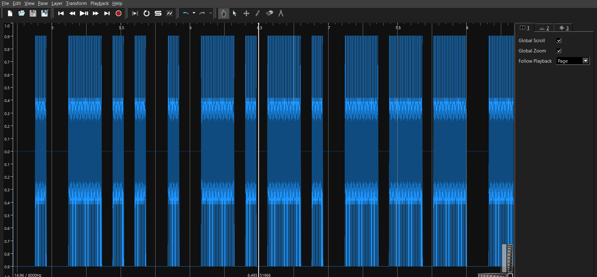

# Germany N2 — Silent Call, Loud Message

**Category:** forensics / network

## Challenge

A VoIP session was captured. The SIP signaling looks ordinary, but the real
message is hidden in the media stream rather than the call metadata. Identify the
codec, extract the audio, and decode what is actually being transmitted.

## Solution

**1. Identify the codec from SDP.** In the SIP packets (UDP 5060) the SDP offer
carries `a=rtpmap:0 PCMU/8000`, so the media is RTP payload type `0` — G.711
µ-law (PCMU) at 8 kHz.

**2. Reassemble the RTP stream.** Parse the pcap, identify RTP headers
(version 2, header ≥ 12 bytes, non-RTCP), group by SSRC, and sort by
sequence/timestamp.

**3. Decode G.711 µ-law to PCM.** Concatenate the PT=0 payloads, µ-law decode to
PCM16 @ 8 kHz, and write a WAV

**4. Read the hidden signal.** The recovered audio is not speech — Sonic Visualiser shows tone bursts that
spell **Morse code**:



```
-.-- ----- ..- .- .-. . -.. . -.-. --- -.. . -.. ...- ----- .---- .--.
 Y    0   U  A  R  E   D  E   C   O  D   E  D   V    0   1   P
```

## Flag

```
CSG_FLAG{Y0UAREDECODEDV01P}
```
